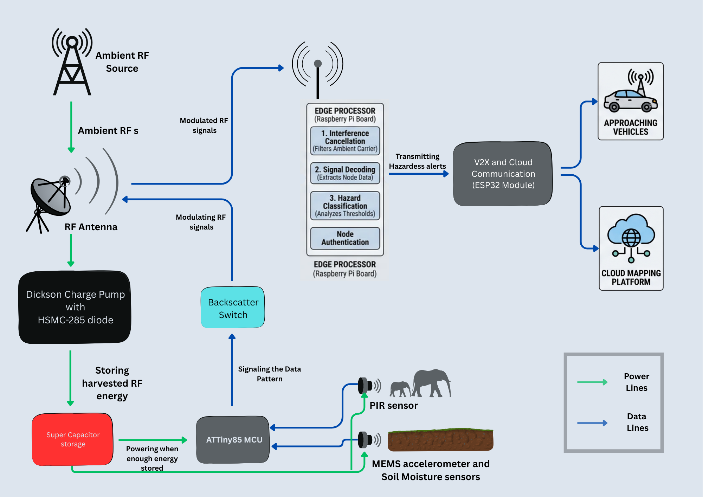

# Ghost_Alert: IoT Hazard Detection system with zero-powered sensor nodes

## Project Overview
Ghost_Alert is an ultra-low-power, ambient RF backscatter system designed for early hazard detection. 

Traditional IoT remote sensor networks require batteries, which are expensive to maintain and environmentally toxic to replace at scale. This project aims to build a network of "zero-power" sensor nodes that harvest their operating energy entirely from surrounding ambient radio waves (such as 4G LTE or Wi-Fi). These nodes monitor for real-world environmental hazards like, wildlife road crossings, track intrusions or landslides, and transmit alerts back to a central gateway without ever needing a battery or mains power.

## Current Solution Summary

| Solution | Power Model | Carrier / Communication | Main Limitation |
| --- | --- | --- | --- |
| Active WSNs (LoRa, NB-IoT, Zigbee) | Battery or solar powered | Nodes generate their own RF transmission | Ongoing maintenance, battery replacement, and solar dependency |
| Traditional RFID / Dedicated Backscatter | Battery-free at the tag | Requires a dedicated reader or emitter | Very short range and high infrastructure density |
| Ambient IoT / Ambient Backscatter | Harvests energy from existing RF signals | Piggybacks on ambient 4G / Wi-Fi signals | Still difficult to scale outdoors because of weak signals and interference |

## Our Solution: Ghost_Alert

Ghost_Alert combines ambient RF harvesting with threshold-based sensing and gateway-side signal recovery. The sensor node stays in deep sleep until enough harvested energy is available, then wakes only when a hazard condition is detected. Instead of generating a new radio carrier, it modulates ambient waves already present in the environment, which removes the battery replacement problem and avoids the need for dedicated RF readers.

At the gateway, the system performs interference cancellation and decoding to extract the weak backscatter signal from the stronger ambient carrier. That decoded event is then turned into a real-time alert, with support for C-V2X dissemination so the warning can reach nearby vehicles quickly.

## How It Works

The system architecture is divided into two main components:

### 1. The Passive Sensor Nodes (The "Ghosts")
* **Energy Harvesting:** The nodes capture ambient RF energy from the environment using an antenna and a highly efficient rectifier circuit, storing it in a supercapacitor.
* **Sensing:** Once enough energy is harvested, an ultra-low-power microcontroller wakes up to take a reading from a connected sensor (e.g., PIR motion, soil moisture).
* **Backscatter Modulation:** Instead of generating their own radio waves to transmit the data (which consumes too much power), the nodes use an RF switch to alter their antenna's impedance. This acts as an "RF mirror," embedding the sensor data into the reflected ambient radio waves.

### 2. The Smart Gateway
* **Signal Decoding:** A powered roadside gateway receives the backscattered signals. It uses interference cancellation to filter out the loud ambient waves and isolate the faint, reflected sensor data.
* **Alert Broadcasting:** Once the hazard data is processed, the gateway rebroadcasts a formatted, high-power warning to approaching vehicles (via V2X communication) or uploads the alert to a cloud-based mapping platform.

## System Architecture Diagram

## Requirements
### Functional Requirements

* **FR1: Energy Harvesting & Transmission:** The passive sensor node shall harvest ambient RF energy to charge its internal capacitor and, upon reaching the required voltage threshold, execute a sensor reading and transmit the telemetry data via RF backscatter modulation.

* **FR2: Signal Isolation:** The gateway shall utilize self-interference cancellation to actively filter out ambient RF carrier waves (e.g., 4G LTE) and isolate the backscattered telemetry signals from the sensor nodes.

* **FR3: Hazard Classification:** The gateway shall analyze incoming sensor data streams against predefined environmental thresholds to classify events (e.g., animal presence, soil displacement) as active hazards.

* **FR4: Alert Dissemination:** Upon detecting a hazard, the gateway shall format the alert payload and broadcast it locally via C-V2X (Cellular Vehicle-to-Everything) protocols, while simultaneously pushing a JSON-formatted event log to the cloud mapping platform.

* **FR5: Node Authentication (Anti-Spoofing):** The gateway shall verify the identity of the transmitting sensor node using a lightweight, pre-shared hardware identifier before accepting any hazard data.

* **FR6: Dynamic Thresholding:** The gateway shall allow remote configuration of the hazard detection thresholds (e.g., adjusting the PIR sensor sensitivity parameters based on changing weather conditions or seasons).

* **FR7: State Health Monitoring (Heartbeats):** Even in the absence of a hazard trigger, the sensor nodes shall execute a minimal "heartbeat" transmission every 2 hours to confirm operational status and ambient harvesting capability.

### Non-Functional Requirements

* **NFR1: Performance (Duty Cycle):** The passive sensor node shall achieve a maximum data transmission interval of 2 seconds when operating in an environment with a minimum ambient RF power density of -20dBm.

* **NFR2: Scalability (Concurrency):** The gateway shall reliably process concurrent backscatter transmissions from multiple overlapping sensor nodes within a 50-meter radius without experiencing critical packet collision failure.

* **NFR3: Fault Tolerance (Data Integrity):** To maintain system state during transmission drops, the gateway shall implement predictive data imputation algorithms capable of handling packet loss from the sensor nodes without triggering a false positive hazard alert.

* **NFR4: Latency (Real-Time Processing):** The gateway shall process incoming backscatter data, classify the hazard, and initiate the outbound C-V2X warning broadcast with an end-to-end latency not exceeding 500 milliseconds.

## Hardware Research

### 1. Passive Sensor Nodes

| Component | Prototype Recommendation |
| --- | --- |
| RF Energy Harvester | Dickson charge pump with HSMS-285C |
| Storage Element | 0.1F to 1F supercapacitor, 5.5V |
| Microcontroller | ATtiny85 |
| Backscatter Switch | SKY13351 |
| Sensors | HC-SR501 PIR(LDO removed), Ultra-Low-Power MEMS Accelerometer, Capacitive Soil Moisture Sensor |

### 2. Smart Gateway

| Component | Prototype Recommendation |
| --- | --- |
| RF Transceiver / SDR | RTL-SDR Blog V4 |
| Edge Processor | Raspberry Pi board |
| V2X / Cloud Module | ESP32 |

