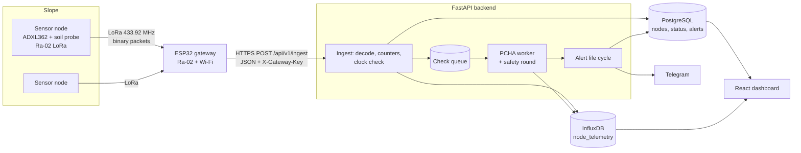

# Ghost_Alert

**Low-cost IoT landslide early-warning system**

Battery-powered tilt + soil-moisture sensor nodes · LoRa 433 MHz · FastAPI · PostgreSQL + InfluxDB ·
Pattern-Classified Hazard Assessment (PCHA) · React live dashboard · Telegram alerts

## Contents

1. [Overview](#1-overview)
2. [Key features](#2-key-features)
3. [System architecture](#3-system-architecture)
4. [Repository structure](#4-repository-structure)
5. [Hardware](#5-hardware)
6. [Radio protocol](#6-radio-protocol)
7. [Detection: PCHA](#7-detection-pcha)
8. [Alert life cycle](#8-alert-life-cycle)
9. [Getting started](#9-getting-started)
10. [Configuration reference](#10-configuration-reference)
11. [Simulator](#11-simulator)
12. [REST API](#12-rest-api)
13. [Testing](#13-testing)
14. [Known limitations](#14-known-limitations)
15. [Roadmap](#15-roadmap)
16. [Team and acknowledgements](#16-team-and-acknowledgements)

## 1. Overview

Rain-induced landslides are a recurring hazard in Sri Lanka's hill country. Commercial slope-monitoring
systems are expensive, so most vulnerable slopes are not instrumented at all.

Ghost_Alert places small, low-cost sensor nodes on a slope. Each node measures **ground tilt**
(ADXL362 accelerometer) and **soil moisture** (capacitive probe), and sends compact binary packets over
**LoRa** to a gateway. The backend stores the readings, classifies the **shape** of each signal over time
(is moisture rising? is tilt speeding up?), confirms dangerous readings with **neighbouring nodes**, and
raises alerts on a live map and on Telegram.

The design goals are:

- **Low cost** and locally available parts.
- **Low power**: nodes sleep most of the time.
- **No silent failures**: a faulty sensor must never hide a landslide, and a silent node is shown as
  *no data*, never as *safe*.
- **Explainable decisions**: every tier comes with a plain-text reason.

## 2. Key features

| Area | What Ghost_Alert does |
|---|---|
| Sensing | Tilt (ADXL362, 3-axis) and capacitive soil moisture on every landslide node |
| Detection | PCHA: 9 moisture patterns × 8 tilt patterns → `normal` / `watch` / `warning` / `critical` |
| Robust maths | MAD outlier rejection, linear trend with significance test (slope > 2 × standard error), per-node 24 h adaptive baseline |
| Neighbour confirmation | `critical` only when **≥ 3 nodes within 50 m** also show movement; otherwise held at `warning` |
| Fault awareness | Dead / bouncing moisture sensors and knock / thermal tilt readings are detected; the decision falls back to the other sensor instead of reporting "safe" |
| Silent nodes | No recent data → tier `no_data` and *offline* on the dashboard |
| Low power | Deep sleep, accelerometer wake-on-motion interrupt, soil probe powered only while reading |
| Reliable link | Per-node packet counters (lost / repeated packets), boot counter (restarts), gateway timestamps |
| Alerts | Live map, critical banner with sound, Telegram messages; raise at once, lower only after a hold time; acknowledge and close with a note |
| Simulation | Scenario simulator that sends real binary packets for clearly labelled **virtual** nodes |

## 3. System architecture


```mermaid
flowchart LR
    subgraph Slope
        N1[Sensor node<br/>ADXL362 + soil probe<br/>Ra-02 LoRa]
        N2[Sensor node]
    end
    N1 -- LoRa 433.92 MHz<br/>binary packets --> GW
    N2 -- LoRa --> GW
    GW[ESP32 gateway<br/>Ra-02 + Wi-Fi] -- HTTPS POST /api/v1/ingest<br/>JSON + X-Gateway-Key --> API
    subgraph Backend [FastAPI backend]
        API[Ingest: decode, counters,<br/>clock check] --> Q[(Check queue)]
        Q --> W[PCHA worker<br/>+ safety round]
        W --> EV[Alert life cycle]
    end
    API --> PG[(PostgreSQL<br/>nodes, status, alerts)]
    API --> IX[(InfluxDB<br/>node_telemetry)]
    W --> IX
    EV --> PG
    EV --> TG[Telegram]
    PG --> UI[React dashboard]
    IX --> UI
```

**Data flow**

1. A node wakes on a timer (or on a motion interrupt), reads its sensors, sends one packet and sleeps again.
2. The ESP32 gateway receives the packet, adds RSSI, SNR and its own clock time, and forwards it as JSON.
3. The backend decodes the packet, checks the counter for lost or repeated packets, converts raw values
   to physical units, writes them to InfluxDB and updates the node's status in PostgreSQL.
4. Each new heartbeat or motion burst queues a PCHA check for that node. A **safety round** also
   re-checks every active node on a timer, so silent nodes are noticed.
5. Tier changes open, raise, lower or close **alerts**, which appear on the dashboard and are sent to Telegram.

## 4. Repository structure

```text
Ghost_Alert/
├── backend/
│   ├── app/
│   │   ├── main.py          # FastAPI app factory, startup of worker and notifier
│   │   ├── config.py        # settings from environment / .env
│   │   ├── packets.py       # binary packet decoder
│   │   ├── convert.py       # raw values → tilt (deg), moisture index, temperature, battery
│   │   ├── ingest.py        # POST /api/v1/ingest (gateway endpoint)
│   │   ├── api.py           # dashboard REST API
│   │   ├── pcha.py          # wrapper that runs the PCHA engine for one node
│   │   ├── worker.py        # background check queue + safety round
│   │   ├── events.py        # alert life cycle (raise, hold, lower, ready to close)
│   │   ├── notify.py        # Telegram sender with retries
│   │   ├── store.py         # telemetry store: InfluxDB or in-memory
│   │   ├── db.py            # PostgreSQL helpers
│   │   └── schema.sql       # PostgreSQL schema
│   ├── engine/
│   │   ├── pattern_engine.py  # PCHA pattern classifiers and decision matrix
│   │   └── acs_engine.py      # shared maths: MAD, trend, baseline, neighbour check
│   ├── scripts/seed_demo.py   # registers the demo zone and nodes
│   ├── tools/
│   │   ├── simulate.py        # scenario simulator (virtual nodes)
│   │   └── fake_gateway.py    # send a single hand-made packet
│   ├── tests/                 # pytest suite
│   ├── docker-compose.yml     # PostgreSQL 16 + InfluxDB 2.7
│   └── .env.example
├── frontend/                  # React 18 + Vite dashboard
│   ├── src/
│   │   ├── api.js             # the only file that talks to the backend
│   │   ├── live.jsx           # shared live data (polls every 10 s)
│   │   ├── format.js          # tiers, colours, pattern explanations, Sri Lanka time
│   │   ├── components/        # map, badges, banners, panels, charts
│   │   └── pages/             # home, dashboard, node, alert, alert history
│   └── .env.example
└── firmware/
    ├── landslide_node/        # Arduino Pro Mini (ATmega328P, 3.3 V / 8 MHz) low-power node
    ├── landslide_node_esp32/  # ESP32 bench node (same packet format)
    ├── esp32_gateway/         # ESP32 LoRa → Wi-Fi gateway
    └── tests/                 # test_blink, test_lora, test_adxl, test_bus
```

## 5. Hardware

### 5.1 Landslide sensor node

| Part | Purpose |
|---|---|
| Arduino Pro Mini 3.3 V / 8 MHz (ATmega328P) | Low-power microcontroller |
| Ai-Thinker Ra-02 (SX1278, 433 MHz) + antenna | LoRa radio |
| ADXL362 | Ultra-low-power 3-axis accelerometer: tilt, temperature, wake-on-motion |
| Capacitive soil moisture sensor | Soil moisture (analog), powered from a GPIO only while reading |
| 18650 Li-ion cell + TP4056 charger + small solar panel | Power |

**Power strategy:** the MCU sleeps using the watchdog timer, the ADXL362 runs in its micro-power
wake-up mode and raises `INT1` on motion, and the soil probe is switched on only for the reading.
The design estimate is **about 4 mAh per day** (not yet measured on hardware; see
[Known limitations](#14-known-limitations)).

### 5.2 ESP32 bench node pin map

| Signal | ESP32 GPIO |
|---|---|
| Ra-02 SCK / MISO / MOSI | 18 / 19 / 23 |
| Ra-02 NSS / RST / DIO0 | 5 / 14 / 26 |
| ADXL362 CS / INT1 | 4 / 27 (shares the SPI bus) |
| Soil probe power / analog out | 25 / 34 |

For the Pro Mini node, the ADXL362 uses `CS = D8` and `INT1 = D2`, and the soil probe uses power
`D7` and analog input `A0`. All pins are defined at the top of each sketch.

### 5.3 Gateway

An ESP32 with an Ra-02 module. It listens continuously, forwards each packet over Wi-Fi to the
backend, and stamps it with its NTP-synchronised clock. Wi-Fi credentials, the backend URL and the
gateway key are kept in `secrets.h` (not committed).

## 6. Radio protocol

**LoRa settings:** 433.92 MHz · SF9 · BW 125 kHz · CR 4/5 · sync word `0x12` · CRC on · TX 10 dBm.

Packets are binary and little-endian. Each packet has a 7-byte header, a type-specific body and a
4-byte zero seal.

| Field | Size | Notes |
|---|---|---|
| Version / type | 1 B | `(1 << 4) \| type` |
| Radio ID | 2 B | identifies the node |
| Boot number | 2 B | increases on every restart (stored in EEPROM / flash) |
| Counter | 2 B | increases on every packet since boot |
| Body | varies | see below |
| Seal | 4 B | `00 00 00 00` |

| Type | Name | Body | Total |
|---|---|---|---|
| 1 | Boot | firmware version, reset reason, node type | 14 B |
| 2 | Heartbeat | ax, ay, az (int16, 0.1 mg) · 5 × moisture ADC (u16) · battery (mV) · temperature (int16, 0.1 °C) · flags | 32 B |
| 3 | Motion burst | ax, ay, az · peak (mg, u16) · duration (s, u8) · flags | 21 B |

**Flags:** `1` soil sensor error · `2` accelerometer error · `4` battery low.

**Gateway → backend** (`POST /api/v1/ingest`, header `X-Gateway-Key`):

```json
{
  "gateway_id": "gw-esp32-01",
  "received_at": "2026-10-09T03:15:00Z",
  "clock_ok": true,
  "rssi": -82,
  "snr": 7.5,
  "payload_hex": "1201000700020..."
}
```

The backend uses the counter and boot number to count lost packets, ignore repeated packets and detect
restarts. Each heartbeat carries 5 moisture samples; they are spread evenly over the time since the
previous heartbeat (when that gap is between 10 s and 15 min).

## 7. Detection: PCHA

**Pattern-Classified Hazard Assessment** decides on the *shape* of each signal, not on a fixed
threshold. A fixed moisture threshold fits one soil and one rainfall rate but misfires on others;
shapes (rising or flat, speeding up or slowing down) carry over between sites much better.

### 7.1 Signal processing

For each node and each check:

1. **Windows:** moisture over 15 min and 24 h; tilt over 2 h and 6 h.
2. **Outlier rejection:** points more than 3.5 robust standard deviations (1.4826 × MAD) from the
   window median are removed.
3. **Trend:** least-squares slope; a trend counts only if `|slope| > 2 × standard error`.
4. **Adaptive baseline:** each node's own 24 h mean and spread, so "wet" and "moving" are judged
   against that node's normal behaviour.

### 7.2 Patterns

| Moisture (9) | Tilt (8) |
|---|---|
| `dry_flat`, `brief_shower`, `sustained_wetting`, `saturated_flat`, `rain_on_wet`, `draining`, `glitch`, **`bouncing`**, **`dead`** | `stable`, `primary_creep`, `secondary_creep`, `tertiary_creep`, `near_failure`, `stopped`, **`knock`**, **`thermal`** |

Patterns in **bold** mean the reading is not trustworthy. The tilt patterns follow **creep theory**:
primary creep slows down (settling), secondary creep is steady, and tertiary creep speeds up before
failure. Tilt-rate guide values: 0.01 °/h (precaution) and 0.10 °/h (warning).

### 7.3 Decision matrix

| Tilt ↓ / Moisture → | dry_flat | brief_shower | sustained_wetting | saturated_flat | rain_on_wet | draining |
|---|---|---|---|---|---|---|
| stable | normal | normal | watch | watch | warning | normal |
| primary_creep | normal | normal | watch | watch | warning | normal |
| secondary_creep | watch | watch | warning | warning | warning | watch |
| tertiary_creep | warning | warning | critical | critical | critical | critical |
| near_failure | critical | critical | critical | critical | critical | critical |
| stopped | stand_down | stand_down | watch | watch | watch | stand_down |

- **Unreliable sensor:** if one sensor is unreliable, the decision is made from the other sensor alone
  and the reason says so (for example *"moisture sensor suspect (dead); decided on tilt near_failure"*).
- **Unexplained movement:** fast tilt with no water signal (for example `near_failure` + `dry_flat`)
  is still alerted on, but flagged as not explained by rainfall.
- **Neighbour confirmation:** a `critical` result is issued only if at least **3 other active nodes
  within 50 m** show movement in the last 15 minutes. Otherwise the node is **held at `warning`**.
  Retired nodes are not counted.
- **No data:** if neither sensor has enough recent data, the tier is `no_data`.

## 8. Alert life cycle

| Rule | Value |
|---|---|
| Opens | when a node reaches `warning` or `critical` |
| Goes up | immediately |
| Goes down | only after the lower level has held for **60 min** (from critical) or **30 min** (from warning / watch) |
| Peak level | recorded and never lowered |
| Ready to close | after **6 h** of calm; an operator closes it with a note |
| Acknowledge | "I've seen it" records who and when; unacknowledged critical alerts send reminders |
| Telegram | sent when an alert opens, rises to warning/critical, falls from warning/critical, becomes ready to close, and for reminders |

Closing an alert does not switch off detection: if the danger is still present, a new alert opens.

## 9. Getting started

### 9.1 Requirements

- Python 3.12, Docker with Docker Compose
- Node.js 18 or newer
- Arduino IDE 2 (for firmware) with the `LoRa` library by Sandeep Mistry and the ESP32 board package

### 9.2 Databases

```bash
cd backend
cp .env.example .env            # then fill in passwords and tokens
docker compose up -d            # PostgreSQL 16 on 127.0.0.1:5432, InfluxDB 2.7 on 127.0.0.1:8086
```

The PostgreSQL schema (`app/schema.sql`) is applied automatically when the backend starts.

### 9.3 Backend

```bash
cd backend
python3 -m venv .venv
source .venv/bin/activate
pip install -r requirements.txt
python -m scripts.seed_demo     # demo zone + real node GA-LS-001 + virtual nodes
uvicorn app.main:app --reload   # http://localhost:8000 , docs at /docs
```

Check `http://localhost:8000/api/v1/health`: `postgres` and `influx` should both be `ok` and
`worker_alive` should be `true`.

### 9.4 Frontend

```bash
cd frontend
cp .env.example .env            # VITE_API_URL=http://localhost:8000
npm install
npm run dev                     # http://localhost:5173
```

| Page | Path |
|---|---|
| Home | `/` |
| Live map and lists | `/dashboard` |
| Node details and charts | `/nodes/:id` |
| Alert history | `/events` |
| One alert (acknowledge / close / timeline) | `/events/:id` |

### 9.5 Firmware

1. Open `firmware/esp32_gateway`, copy `secrets.h.example` to `secrets.h`, set Wi-Fi, backend URL and
   `GATEWAY_API_KEY`, and upload to the gateway ESP32.
2. Upload `firmware/landslide_node_esp32` (bench node) or `firmware/landslide_node` (Pro Mini,
   3.3 V / 8 MHz via a USB-TTL adapter).
3. Set a unique `RADIO_ID` per node and register it in PostgreSQL (or in `scripts/seed_demo.py`).
4. `DEMO_MODE` shortens the cycle (8 s sampling, 40 s heartbeat) for demonstrations.

### 9.6 Telegram

1. Create a bot with **@BotFather** (`/newbot`) and copy the token.
2. Send any message to the bot, then open `https://api.telegram.org/bot<TOKEN>/getUpdates` and copy
   `chat.id`.
3. Set `TELEGRAM_BOT_TOKEN` and `TELEGRAM_CHAT_ID` in `backend/.env` and restart the backend.

Without a token, alert messages are written to the backend log only.

## 10. Configuration reference

**`backend/.env`**

| Variable | Required | Default | Description |
|---|---|---|---|
| `PG_URL` | yes | — | SQLAlchemy URL, e.g. `postgresql+psycopg2://ghost:<pw>@localhost:5432/ghost_alert` |
| `GATEWAY_API_KEY` | yes | — | Shared secret sent by the gateway in `X-Gateway-Key` |
| `TELEMETRY_STORE` | no | `influx` | `influx`, or `memory` for development without InfluxDB |
| `INFLUX_URL` | no | `http://localhost:8086` | InfluxDB URL |
| `INFLUX_TOKEN`, `INFLUX_ORG`, `INFLUX_BUCKET` | with `influx` | — | InfluxDB access |
| `CORS_ORIGINS` | no | `http://localhost:5173` | Comma-separated dashboard origins |
| `DASHBOARD_URL` | no | `http://localhost:5173` | Link used in Telegram messages |
| `TELEGRAM_BOT_TOKEN`, `TELEGRAM_CHAT_ID` | no | empty | Telegram alerts |
| `SAFETY_ROUND_S` | no | `300` | Seconds between safety rounds over all nodes |
| `BACKEND_URL` | no | `http://localhost:8000` | Used by the simulator |

**`frontend/.env`**

| Variable | Description |
|---|---|
| `VITE_API_URL` | Backend base URL |
| `VITE_CARTO_KEY` | Optional CARTO basemap key; without it, darkened OpenStreetMap tiles are used |

Never commit `.env` or `secrets.h`.

## 11. Simulator

`tools/simulate.py` creates **virtual** nodes `GA-LS-V01` … `GA-LS-V04` around the demo slope. It builds
real binary packets and sends them through the normal ingest endpoint, so they pass through the same
decoder, storage, PCHA and alert logic as real nodes. Virtual nodes are always labelled
**SIMULATED** on the dashboard and in Telegram messages.

```bash
cd backend
python -m tools.simulate --list
python -m tools.simulate tour --minutes 30
```

It first writes 26 h of history (about 10 s; no checks are queued for history), then sends one heartbeat
per node every 40 s.

| Scenario | Description | Expected result |
|---|---|---|
| `calm` | Dry, no movement | all `normal` |
| `rain` | Steady rain, no movement | all `watch` |
| `creep` | V04 steady creep in rain | V04 `warning` |
| `localised` | Only V04 accelerates | V04 `warning`, held (0/3 neighbours) |
| `slope_failure` | All nodes accelerate with motion bursts | V01, V04 `critical`; V02, V03 held at `warning` (only 2 neighbours within 50 m) |
| `tour` | V01 rain · V02 dead soil sensor + accelerating tilt · V03 silent · V04 calm | `watch` · `warning` · `no_data` · `normal` |

Options: `--minutes N`, `--no-live`, `--keep` (keep previous virtual data), `--url`.
With `TELEMETRY_STORE=memory`, restart the backend before switching scenarios.

## 12. REST API

Base path `/api/v1`. Interactive documentation is available at `/docs` while the backend runs.

| Method | Path | Description |
|---|---|---|
| `POST` | `/ingest` | Gateway packet upload (requires `X-Gateway-Key`) |
| `GET` | `/health` | Database, InfluxDB and worker status |
| `GET` | `/nodes` | All non-retired nodes with current tier, patterns and health |
| `GET` | `/nodes/{id}` | One node |
| `GET` | `/nodes/{id}/telemetry?hours=&fields=` | Time series (e.g. `moisture_index,tilt_deg,temp_c,rssi`) |
| `GET` | `/nodes/{id}/tiers?hours=` | Tier history |
| `GET` | `/events?state=open\|resolved\|all&limit=` | Alerts |
| `GET` | `/events/{id}` | One alert with its timeline |
| `POST` | `/events/{id}/acknowledge` | Body `{"by": "name"}` |
| `POST` | `/events/{id}/close` | Body `{"by": "name", "note": "what was checked"}` |

## 13. Testing

```bash
cd backend
TEST_PG_URL='postgresql+psycopg2://ghost:<pw>@localhost:5432/ghost_test' python -m pytest -q
```

The suite covers the packet decoder, PCHA patterns, the alert life cycle, the full ingest → PCHA →
alert pipeline, and every simulator scenario. Pipeline tests need an **empty test database** and
**delete all its tables**; never point `TEST_PG_URL` at the production database. Without a reachable
test database those tests are skipped.

Create the test database once:

```bash
docker exec -it backend-postgres-1 psql -U ghost -d ghost_alert -c "CREATE DATABASE ghost_test;"
```

## 14. Known limitations

Ghost_Alert is a prototype. These limitations are known and documented:

- **Field validation:** detection has been tested with simulated scenarios and bench movements, not with
  a real slope failure. Thresholds need site calibration.
- **Soil moisture units:** the moisture value is a relative index (sensor in air = 0, in water = 100),
  not volumetric water content. Each probe needs calibration in the target soil.
- **Battery life:** about 4 mAh/day is a design estimate; it has not yet been measured on hardware. The
  ESP32 bench node is USB powered.
- **Short trends:** outlier rejection uses the median of the whole window, so a change covering less than
  about half of a window can be rejected as outliers (e.g. a few hours of rain in a 24 h window).
- **Sudden tilt:** a fast tilt by hand is classified as `knock` by design (sudden movement is not creep).
- **Flicker:** a single rejected moisture point (`glitch`) can make the tier switch between `watch` and
  `normal`.
- **Acceleration ratio:** the tilt acceleration test splits the 2 h window by number of points rather
  than by time, so mixed sampling rates can distort it.
- **Missing tilt channel** is currently treated as `stable`.
- **Security:** a single shared gateway key; the dashboard has no user login (operator name only).

## 15. Roadmap

- Measure node power consumption and battery life on hardware.
- Field deployment and site calibration of moisture and tilt thresholds.
- Fix the engine issues listed above (time-based acceleration ratio, trend-aware outlier rejection).
- Dashboard login, roles and an admin page for registering nodes.
- Multiple gateways and per-gateway keys.
- SMS alerts for areas without mobile data.

## 16. Team and acknowledgements

- **R.I.B.S.P. Rathnamalala** — Department of Computer Science and Engineering, University of Moratuwa
<!-- Add other team members and the project supervisor here. -->

Map data © [OpenStreetMap](https://www.openstreetmap.org/copyright) contributors.
Built with FastAPI, PostgreSQL, InfluxDB, React, Vite, Leaflet and Recharts.

<!-- License: choose one (for example MIT) and add a LICENSE file. -->
